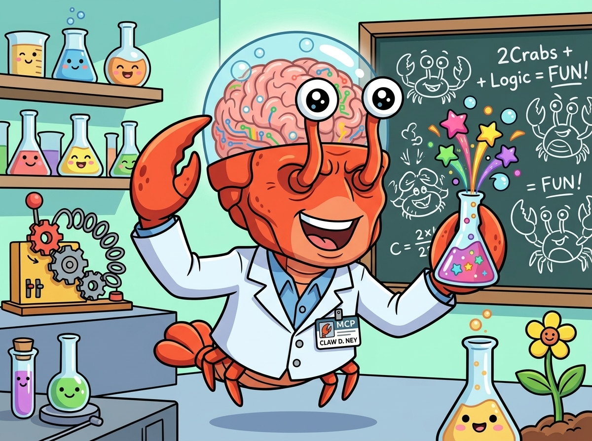

# 🧠 Clawdiney

**Expanded Brain for Coding Agents**

A hybrid **Vector + Graph** system that transforms your Obsidian Vault into a living knowledge source for coding agents.

<p align="center">
  
</p>

---

## 🚀 Overview

Clawdiney enables AI agents to query your knowledge base with a retrieval-first workflow:

- **Semantic Search:** Finds patterns, SOPs and components by meaning (not just keywords)
- **Knowledge Graph:** Maps relationships between notes via `[[WikiLinks]]`
- **Canonical Note Resolution:** Resolves ambiguous note names to vault-relative paths
- **Native Integration:** Connects to MCP-compatible agents via Model Context Protocol

---

## 📋 Prerequisites

Before starting, make sure you have installed:

| Software | Minimum Version | Link |
|----------|-----------------|------|
| **Docker** | 20.x+ | [docker.com](https://docs.docker.com/get-docker/) |
| **Docker Compose** | 2.x+ | Included in Docker Desktop or `apt install docker-compose-plugin` |
| **Ollama** | 0.1.x+ | [ollama.com](https://ollama.com/) |
| **Python** | 3.10+ | Usually already installed on Unix systems. If not: `apt install python3` or `brew install python@3.12` |

**Supported Systems:**
- ✅ Linux (Ubuntu, Debian, Fedora, Arch, etc.)
- ✅ macOS (Intel and Apple Silicon)
- ✅ WSL2 (Windows Subsystem for Linux)
- ✅ BSD (FreeBSD, OpenBSD - with manual adjustments)

---

## 🛠️ Quick Installation

### Create the Vault (If you don't have one)

If you **don't have a vault yet**, use the creation script:

```bash
chmod +x setup_vault.sh
./setup_vault.sh
```

**The script will:**
- ✅ Create folder structure (P.A.R.A. method)
- ✅ Create `00_Index.md` (vault documentation)
- ✅ Create basic SOPs (Backend, Design System, etc.)
- ✅ Create `Agent_Protocol.md` (instructions for AI)
- ✅ Optional: Initialize Git repository

---

**Clone this repository:**
```bash
git clone git@github.com:elaranjo/clawdiney.git
cd clawdiney
```

**Configure `.env`:**
```bash
cp .env.example .env
nano .env
```

**Run the Bootstrapper:**
```bash
chmod +x setup_brain.sh
./setup_brain.sh
```

---

## 📋 What the Bootstrapper Does

The `setup_brain.sh` script automatically executes:

| Step | Action |
|------|--------|
| 🔍 | Checks if Docker, Docker Compose and Ollama are installed |
| 📝 | Creates `.env` with default settings (if it doesn't exist) |
| 🐳 | Starts Neo4j + ChromaDB containers via Docker Compose |
| 🐍 | Creates Python virtual environment (`venv`) |
| 📦 | Installs Python dependencies (`neo4j`, `chromadb`, `ollama`, etc.) |
| ✅ | **Checks and auto-repairs** missing dependencies |
| 🦙 | Downloads embedding model (`bge-m3`) via Ollama |
| 🧠 | Indexes your Vault in the database |

---

**⚠️ Important:** Point `VAULT_PATH` to the **dedicated vault**, not your personal vault.

### 2. Configure Your MCP Client

To enable a local MCP client to use the Brain natively, add the configuration to your client config:

```json
{
  "projects": {
    "/home/YOUR_WORK_DIRECTORY": {
      "mcpServers": {
        "clawdiney": {
          "command": "/home/YOUR_WORK_DIRECTORY/clawdiney/venv/bin/python3",
          "args": [
            "/home/YOUR_WORK_DIRECTORY/clawdiney/brain_mcp_server.py"
          ]
        }
      }
    }
  }
}
```

---

## 🚀 Usage

### Start All Services

To start all services (Neo4j, ChromaDB and MCP Server) together:

```bash
./run_brain.sh
```

This script will:
- Start Docker containers for Neo4j and ChromaDB
- Wait for services to initialize
- Index the Obsidian vault
- Start the MCP server in background

### Stop All Services

To stop all services, press Ctrl+C in the terminal where `run_brain.sh` is running, or execute:

```bash
docker compose down
```

### Via MCP Client (Recommended)

With MCP configured, the agent should use `search_brain` as the primary discovery tool:

> *"Check in the Brain if there are any SOPs for production deployment."*

> *"Search the brain for UI Design System patterns."*

> *"Use the search_brain tool to find the folder structure of repositories."*

When a result is ambiguous, resolve it with:

- `resolve_note(name)` to list canonical paths
- `get_note_chunks(path)` to inspect indexed sections

Full-file reading is intentionally outside the MCP workflow. The agent should use the repository or vault filesystem directly after `search_brain` has identified the relevant note.

### Via Shell (Alternative)

If MCP is not available, use the direct script:

```bash
./ask_brain.sh "production deployment patterns"
```

### Via Python (For developers)

```bash
./venv/bin/python3 query_engine.py "your query here"
```

---

## 🧩 Architecture

```
┌─────────────────────────────────────────────────────────────┐
│                     Claude Code (Agent)                     │
└─────────────────────┬───────────────────────────────────────┘
                      │ MCP Protocol / Shell
                      ▼
┌─────────────────────────────────────────────────────────────┐
│                   Clawdiney (Server)                        │
│  ┌──────────────────────┐     ┌──────────────────────────┐  │
│  │   ChromaDB (Vector)  │     │   Neo4j (Graph)          │  │
│  │  - Semantic Search   │     │  - Relationships         │  │
│  │  - bge-m3 embeddings │     │  - [[WikiLinks]]         │  │
│  └──────────────────────┘     └──────────────────────────┘  │
└─────────────────────────────────────────────────────────────┘
                      │
                      ▼
┌─────────────────────────────────────────────────────────────┐
│              Obsidian Vault (Knowledge Source)              │
│  - SOPs, Design System, Architecture, Patterns             │
└─────────────────────────────────────────────────────────────┘
```

---

## 🔄 Updating Knowledge

Whenever the Vault is updated (new SOPs, patterns, etc.):

```bash
# Re-index the Vault
./venv/bin/python3 brain_indexer.py
```

The agent will have immediate access to new information in the next query after re-indexing.

---

## 🛡️ Privacy and Security

- **Personal Vault vs. Dedicated Vault:** This system was designed to use a **dedicated vault**. We don't recommend using your personal vault.
- **Local Data:** Everything runs locally on your machine. Nothing is sent to the cloud (except if you use cloud models).
- **Isolation:** Database data (Neo4j/ChromaDB) stays in local Docker volumes.

---

## 🐛 Troubleshooting

### MCP client doesn't see the server
- Check if the client configuration points to `brain_mcp_server.py`.
- Restart the client session.
- Test the server manually: `./venv/bin/python3 brain_mcp_server.py`

### Neo4j connection error
- Check if the container is running: `docker ps | grep neo4j`
- If necessary, restart: `docker compose restart`

### ChromaDB connection error
- Check logs: `docker compose logs chromadb`
- Recreate the database (data will be lost): `rm -rf chroma_db && docker compose up -d`

---

## 📚 Useful Commands

```bash
# Check container status
docker compose ps

# View Neo4j logs
docker compose logs neo4j

# Stop all services
docker compose down

# Start all services (including MCP Server)
./run_brain.sh

# Re-index the Vault
./venv/bin/python3 brain_indexer.py

# Test search
./ask_brain.sh "your query"
```

---

## ❓ FAQ (Frequently Asked Questions)

### "Do I need Obsidian installed?"
**No.** Obsidian is just an editor. The Brain reads `.md` files directly, so you only need the Vault files.

### "Can I use my personal vault?"
**Technically yes, but we don't recommend it.** If you point to your personal vault, it may cause confusion with the agent's data.

### "How long does indexing take?"
It depends on the Vault size:
- **Small vault** (< 100 notes): ~30 seconds
- **Medium vault** (100-500 notes): 1-2 minutes
- **Large vault** (> 500 notes): 3-5 minutes

### "Do I need to re-index every time I update an SOP?"
**Yes. For now** Whenever the Vault changes, run:
```bash
./venv/bin/python3 brain_indexer.py
```

### "Does it work on Windows?"
**Yes!** Through **WSL2** (Windows Subsystem for Linux). Follow these steps:
1. Install WSL2: `wsl --install` (in PowerShell as Admin)
2. Install Docker Desktop for Windows and enable WSL2 integration
3. Inside WSL2, follow the normal installation instructions as if it were Linux

### "Which Linux distribution is recommended?"
The system has been tested mainly on **Ubuntu 22.04+** and **Debian 11+**, but it should work on any modern distribution with Docker and Python 3.10+.

### "What if I use another model instead of Qwen in Ollama?"
**It works normally.** The Brain is model-agnostic. You use whatever model you prefer in Claude Code. The `bge-m3` is just for generating embeddings (vectors), not for answering questions.

---

## 🤝 Contributing

To add new tools to MCP:
1. Edit `brain_mcp_server.py`
2. Add a new function decorated with `@mcp.tool()`
3. Test locally before committing.

---

## 📄 License

MIT License

---

**Created with ❤️ by the Voices in My Head team**

**Compatibility:** Linux • macOS • WSL2 • Unix-like
